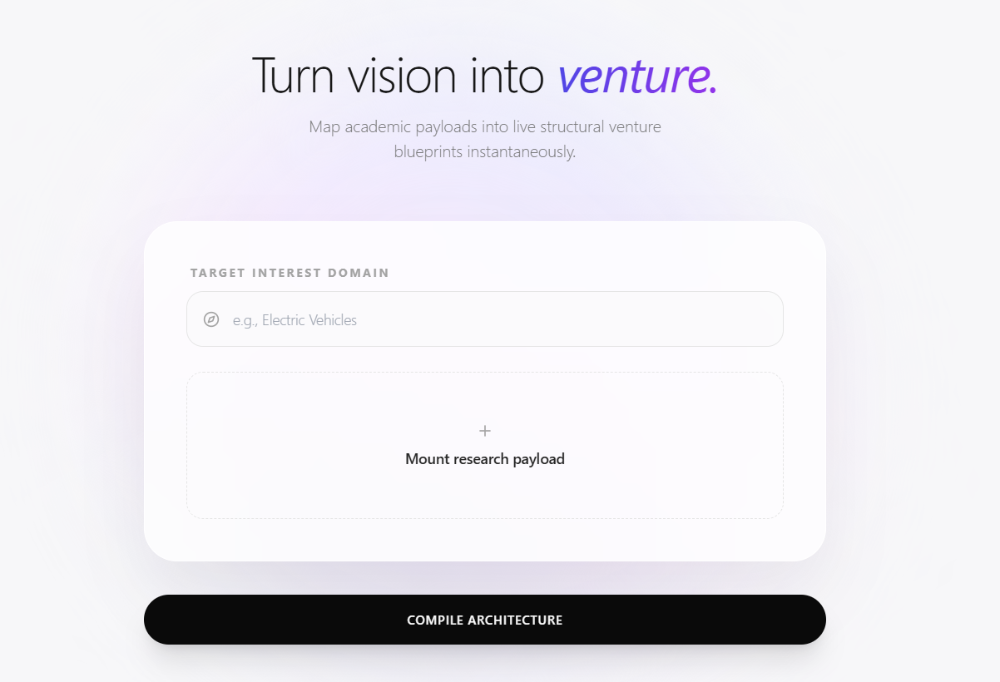
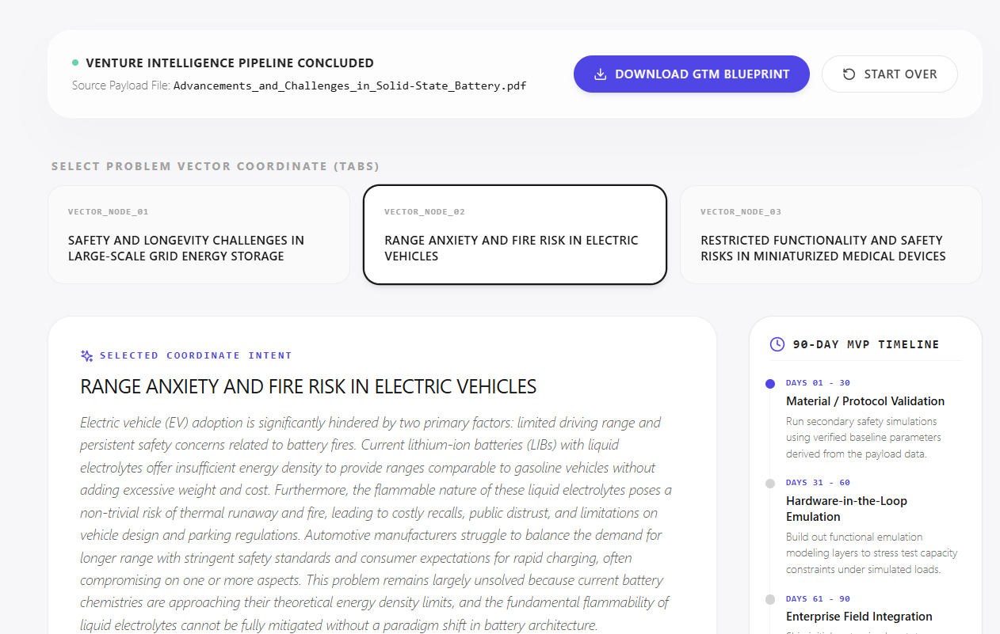
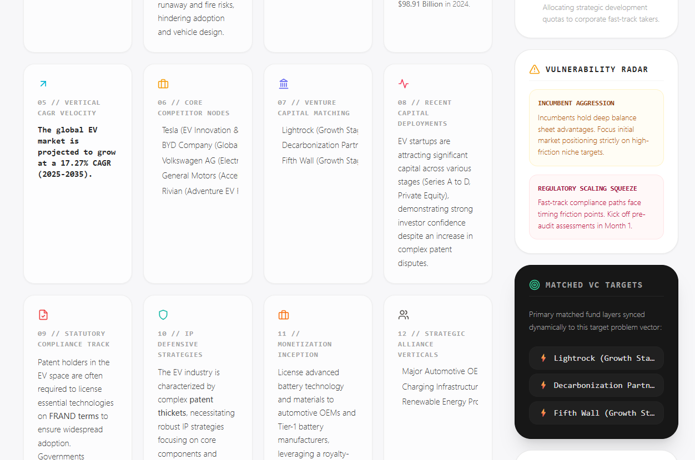

# STARTARCH

> Transforming Research into Venture-Ready Opportunities

STARTARCH is an AI-powered commercialization platform that helps bridge the gap between academic research and real-world innovation. By combining multi-agent workflows, market intelligence, and fine-tuned commercialization models, STARTARCH converts research papers into actionable startup opportunities, investment insights, and commercialization roadmaps.


---

## The Problem

Every year, thousands of breakthrough research papers are published across universities, research labs, and industrial R&D teams.

Despite their technical value, only a small fraction successfully make the transition from the laboratory to the market.

Researchers often lack:

* Commercialization expertise
* Market validation
* Industry connections
* Venture creation support
* Technology transfer guidance

As a result, promising innovations remain trapped in academic literature.

STARTARCH helps identify which research has commercial potential and provides an AI-assisted pathway toward bringing it to market.

---

## What STARTARCH Does

Upload a research paper and receive:

* Structured research extraction
* Commercialization-focused problem statements
* Market opportunity analysis
* Competitor intelligence
* Funding landscape insights
* Business model recommendations
* Commercialization bottleneck detection
* Venture-style investment evaluations
* Potential co-founder recommendations



---

## Key Features

### Research Paper Intelligence

Extracts critical information from academic and technical papers including:

* Title
* Domain
* Abstract
* Problem being solved
* Current limitations
* Proposed solution
* Key findings
* Measurable improvements
* Limitations
* Future work
* Research maturity

---

### Opportunity Discovery

Converts research findings into venture-grade problem statements that can be validated commercially.

Outputs:

* Real-world customer problems
* Target industries
* Market opportunities
* Commercialization directions

---

### Market Intelligence

Performs automated market research using live web intelligence.

Generates:

* Total Addressable Market (TAM)
* Growth rates
* Competitor analysis
* Funding activity
* Industry trends
* Regulatory requirements
* Strategic partnerships
* Business model recommendations
* IP landscape analysis

---

### Commercialization Bottleneck Detection

STARTARCH includes a fine-tuned commercialization classifier built using Pioneer.

The model predicts the primary obstacle preventing a research opportunity from successfully reaching the market.

Possible bottlenecks include:

* REGULATORY_APPROVAL
* CUSTOMER_ADOPTION
* MANUFACTURING_SCALE
* CAPITAL_REQUIREMENTS
* IP_DEFENSIBILITY
* GO_TO_MARKET
* TECHNICAL_MATURITY

These predictions are incorporated into downstream investment and commercialization analysis.

---

### Venture Evaluation

Generates investor-style evaluations including:

* Investment verdict
* Venture scorecard
* Commercialization recommendations
* Strategic pivots
* Market readiness assessment

---

### Co-Founder Discovery

Suggests researchers, domain experts, and potential collaborators aligned with the research area.

---

# Architecture

## End-to-End Workflow

```text
Research Paper
      ↓
Paper Extraction Agent
      ↓
Problem Discovery Agent
      ↓
Market Research Agent
      ↓
Commercialization Bottleneck Classifier
      ↓
Venture Consultant Agent
      ↓
Co-Founder Discovery Agent
      ↓
Commercialization Dashboard
```

---

## Agent Architecture

### 1. Paper Extraction Agent

Purpose:

Convert research papers into structured commercialization-ready data.

Outputs:

* Research metadata
* Key findings
* Technical limitations
* Research maturity indicators

---

### 2. Problem Discovery Agent

Purpose:

Identify real-world opportunities hidden within academic research.

Outputs:

* Problem statements
* Industry mappings
* Customer pain points

---

### 3. Market Research Agent

Purpose:

Generate venture-grade market intelligence using Tavily.

Outputs:

* Market size
* Growth projections
* Competitor landscape
* Funding trends
* Regulation analysis
* Business models
* Strategic partnerships

---

### 4. Commercialization Bottleneck Classifier

Purpose:

Identify the largest obstacle preventing commercialization.

Technology:

* Pioneer Synthetic Data Generation
* Pioneer GLiNER2 Fine-Tuning
* LoRA Training

Outputs:

* Commercialization bottleneck
* Confidence score

Labels:

* REGULATORY_APPROVAL
* CUSTOMER_ADOPTION
* MANUFACTURING_SCALE
* CAPITAL_REQUIREMENTS
* IP_DEFENSIBILITY
* GO_TO_MARKET
* TECHNICAL_MATURITY

---

### 5. Venture Consultant Agent

Purpose:

Perform startup-style due diligence on opportunities.

Outputs:

* Investment recommendation
* Venture scorecard
* Executive justification
* Pivot recommendations

---

### 6. Co-Founder Discovery Agent

Purpose:

Suggest relevant collaborators and domain experts aligned with the research area.

Outputs:

* Potential co-founders
* Domain-aligned experts
* Collaboration opportunities

---

# Fine-Tuned Commercialization Model

STARTARCH includes a specialized commercialization classifier built using Pioneer.

## Workflow

```text
Market Research Data
        ↓
Synthetic Dataset Generation
        ↓
Pioneer Fine-Tuning
        ↓
Commercialization Bottleneck Classifier
        ↓
Investment Evaluation
```

## Training Pipeline

1. Generate synthetic commercialization datasets using Pioneer.
2. Fine-tune GLiNER2 using classification labels.
3. Deploy the trained model.
4. Integrate predictions into the venture consulting workflow.

The model helps identify the dominant commercialization challenge associated with a research opportunity before final investment analysis.

---

# Technology Stack

## AI & ML

* Google Gemini 2.5 Flash
* Google Gemini 2.5 Pro
* Pioneer GLiNER2
* Tavily Search API

## Backend

* Flask
* Python
* ThreadPoolExecutor
* REST APIs

## Frontend

* React
* JavaScript

## Data Processing

* LangChain
* Pydantic
* PyPDFLoader

---

# Partner Technologies Used

## Google Gemini

Used for:

* Research extraction
* Opportunity generation
* Venture consulting
* Commercialization reasoning

---

## Tavily

Used for:

* Market intelligence
* Competitor discovery
* Industry research
* Funding analysis
* Regulatory analysis

---

## Pioneer

Used for:

* Synthetic dataset generation
* Fine-tuning commercialization classifiers
* Commercialization bottleneck detection
* Production inference

---

## Aikido

* Security analysis of the project

---

Used for:

* Synthetic dataset generation
* Fine-tuning commercialization classifiers
* Commercialization bottleneck detection
* Production inference

---

# Project Structure

```text
STARTARCH/
│
├── backend/
│   ├── extractor_agent/
│   ├── problem_statement_agent/
│   ├── market_analysis_agent/
│   ├── pioneer_agent/
│   ├── cofounder_agent/
│   └── app.py
│
├── frontend/
│
├── papers/
│
├── uploads/
│
├── requirements.txt
│
└── README.md
```

---

# Getting Started

## Prerequisites

* Python 3.10+
* Node.js 18+

Create a `.env` file in the project root:

```env
GEMINI_API_KEY=your_key
TAVILY_API_KEY=your_key
PIONEER_API_KEY=your_key
```

---

## Backend Setup

```bash
pip install -r requirements.txt
cd backend
python app.py
```

Backend runs on:

```text
http://localhost:5000
```
---

## Frontend Setup

Open a second terminal:

```bash
cd frontend
npm install
npm start
```

Frontend runs on:

```text
http://localhost:3000
```

---

## Using STARTARCH

1. Open the frontend.
2. Select a target domain.
3. Upload a research paper PDF.
4. Wait for the analysis pipeline to complete.
5. Review generated opportunities and venture insights.

---

# API

## Analyze Research Paper

```http
POST /analyze-paper
```

### Form Data

| Field          | Type   | Description            |
| -------------- | ------ | ---------------------- |
| research_paper | File   | Research paper PDF     |
| domain         | String | Target industry/domain |

---

## Health Check

```http
GET /health
```

Returns:

```json
{
  "status": "ok"
}
```

---

# Output Artifacts

Each analysis session creates a dedicated folder:

```text
uploads/<session-id>/
```

Containing:

* extraction_result.json
* problem_statements.json
* market_data_*.json
* bottleneck_*.json
* final_verdict_*.json
* co_founders.json

---

# Vision

STARTARCH aims to become an AI-powered technology transfer platform that helps researchers, founders, investors, universities, and innovation hubs identify the most promising paths for transforming research into successful products and companies.
